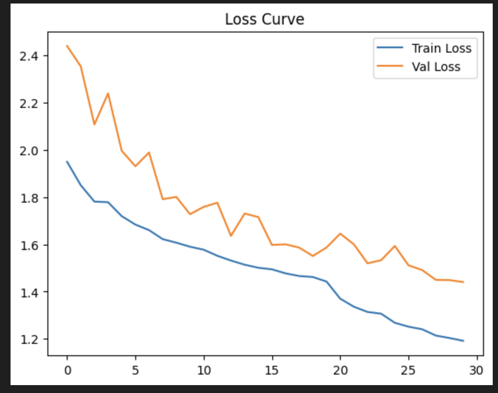
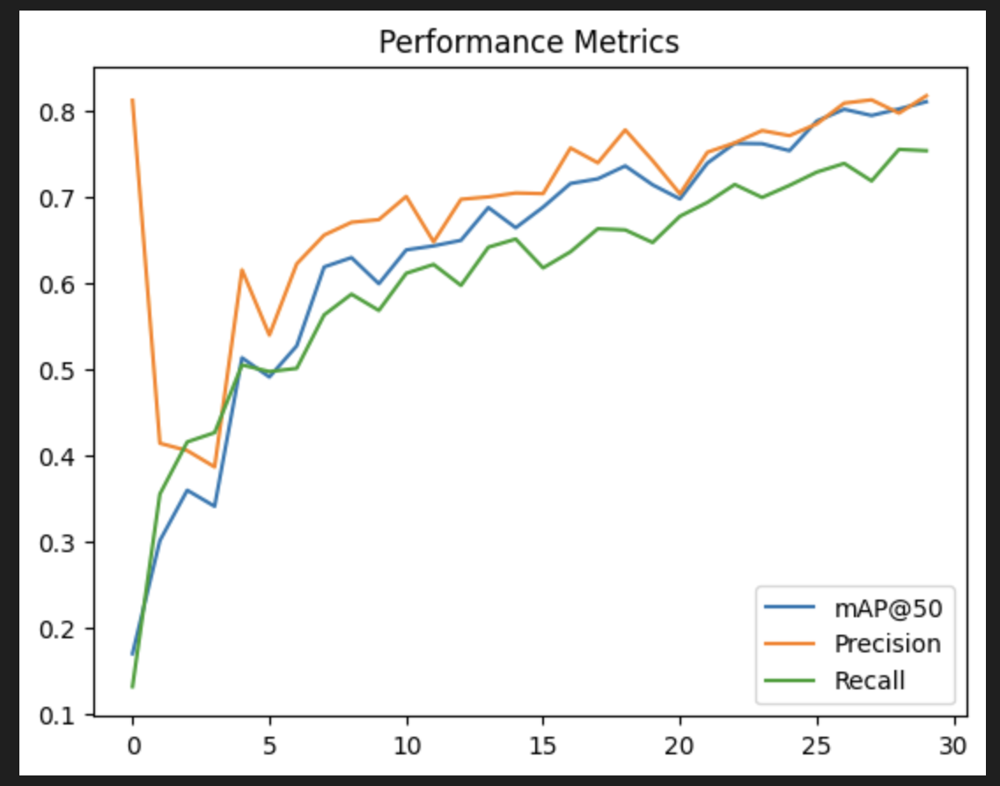
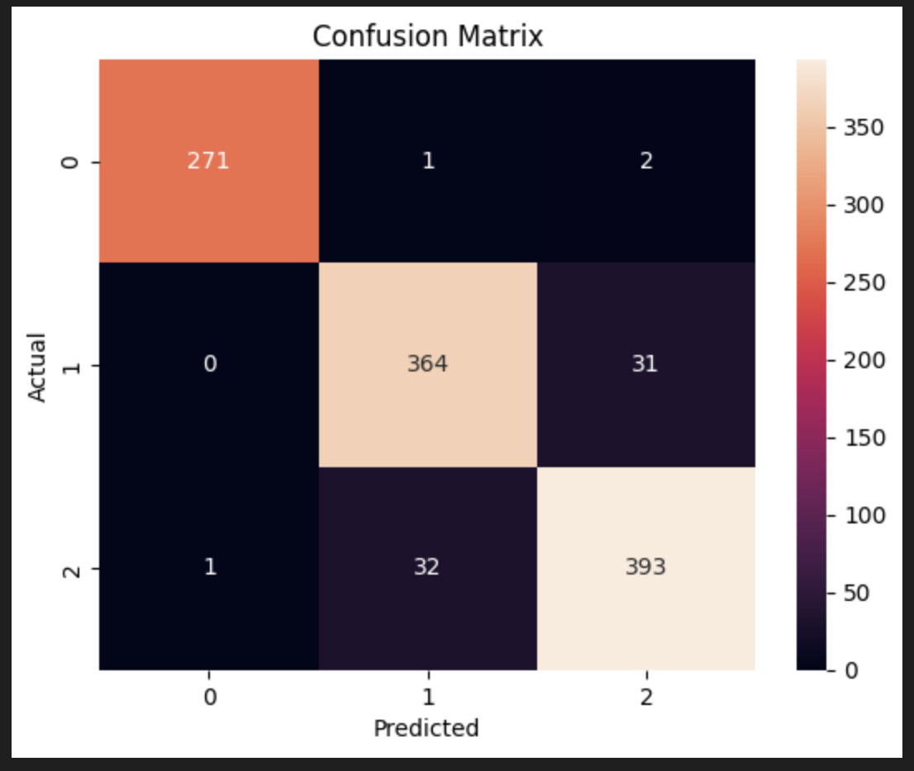
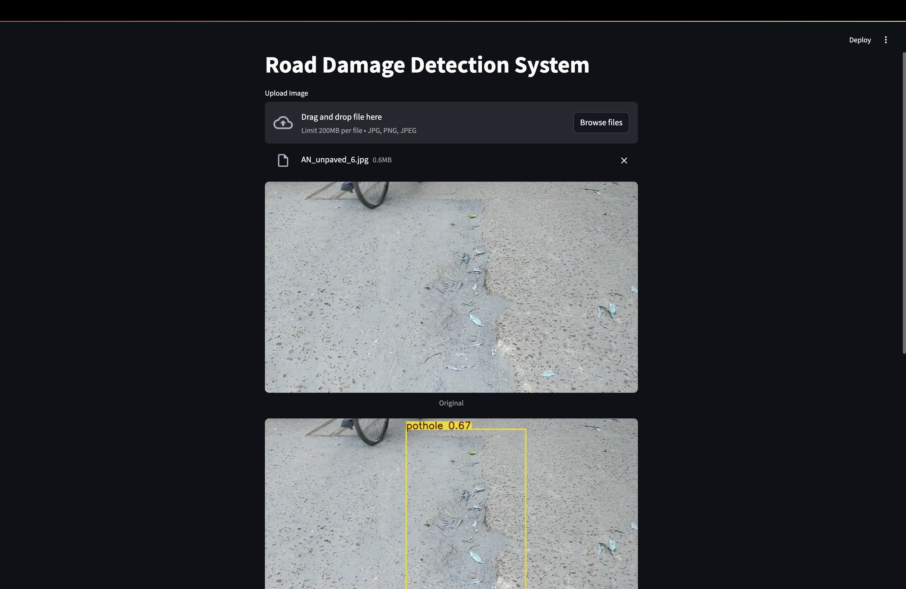
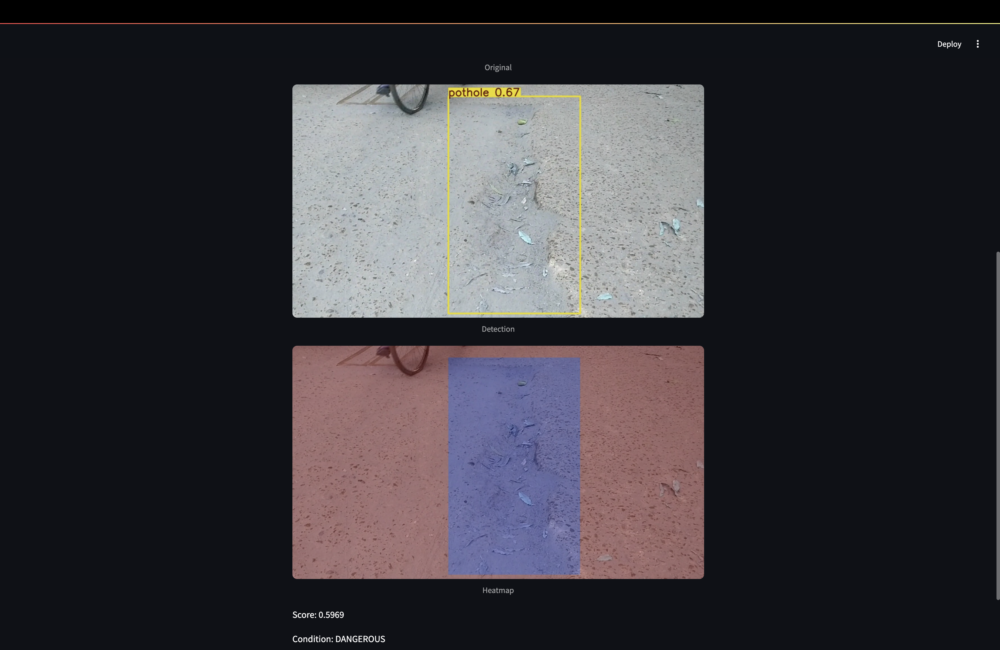

# Indian Road Condition Detector

A real-time road hazard detection system built with YOLOv11 trained on Indian road images.
Detects potholes, speed breakers, and unpaved roads from images,
computes a weighted severity score, and classifies road condition as
GOOD, MODERATE, or DANGEROUS.
Deployed as an interactive Streamlit web app.

---

### What it does

- Downloads and prepares the Indian Roads Dataset from Kaggle automatically
- Trains YOLOv11n from scratch with custom augmentations on 3 hazard classes
- Supports checkpoint resume — training can continue from last saved epoch
- Computes a weighted severity score per image based on detected hazard area
- Generates a heatmap overlay showing hazard density across the image
- Evaluates with mAP@50, Precision, Recall, and confusion matrix
- Plots training loss and performance metric curves
- Deploys a Streamlit web app for real-time image upload and prediction

---

### Classes

| ID | Class | Severity Weight |
|---|---|---|
| 0 | Speed Breaker | 1.5 |
| 1 | Pothole | 2.0 (highest — most dangerous) |
| 2 | Unpaved Road | 1.2 |

---

### Dataset

Indian Roads Dataset — [mitangshu11/indian-roads-dataset on Kaggle](https://www.kaggle.com/datasets/mitangshu11/indian-roads-dataset)

- 3 hazard classes with bounding box annotations
- 80/20 train/val split applied automatically in the notebook
- YOLO format labels (class x_center y_center width height)

---

### How Severity Scoring Works
For each detected bounding box:
area_ratio = box_area / total_image_area
score += area_ratio × class_weight
Thresholds:
score < 0.03   → GOOD
score < 0.10   → MODERATE
score ≥ 0.10   → DANGEROUS

This means a large pothole (weight 2.0) covering 10% of the image
scores higher than a small speed breaker covering the same area.

---

### Architecture
YOLOv11n (nano — lightweight, fast)
Pretrained on COCO → fine-tuned on Indian Roads Dataset
Input size   : 640×640
Epochs       : 30
Batch size   : 16
Optimizer    : AdamW (lr = 0.001)
Augmentation : Mosaic (1.0) · Mixup (0.2) · Rotation (±10°)
Output       : Bounding boxes + class labels + confidence scores

---

### Training Setup
Model         YOLOv11n (yolo11n.pt pretrained)
Epochs        30
Image size    640×640
Batch size    16
Optimizer     AdamW (lr = 0.001)
Augmentation  Mosaic · Mixup · Random rotation
Checkpoint    Auto-resume from last.pt if interrupted
Framework     Ultralytics YOLO

---

### Training Curves

After running the notebook, save these plots from the output:

**Loss Curve (Train vs Validation):**



**Performance Metrics (mAP@50, Precision, Recall):**



**Confusion Matrix:**



---

### Streamlit Web App

The notebook writes a `app.py` file and launches it via ngrok.
Users can upload any road image and get:
- Bounding box detections with class labels
- Severity score
- Road condition classification (GOOD / MODERATE / DANGEROUS)




---

### Project Structure

| File/Folder | Description |
|---|---|
| `road_condition_detector.ipynb` | Full training and evaluation notebook |
| `app.py` | Streamlit web app (auto-generated by notebook) |
| `data.yaml` | YOLO dataset configuration |
| `requirements.txt` | Python dependencies |
| `dataset/images/train/` | Training images |
| `dataset/images/val/` | Validation images |
| `dataset/labels/train/` | YOLO format train labels |
| `dataset/labels/val/` | YOLO format val labels |
| `runs/detect/model2/weights/best.pt` | Best model weights |
| `runs/detect/model2/weights/last.pt` | Last checkpoint for resume |
| `runs/detect/model2/results.csv` | Training metrics per epoch |
---

### Stack

| | |
|---|---|
| **Detection** | Ultralytics YOLOv11 |
| **CV** | OpenCV |
| **Data** | Pandas · NumPy · kagglehub |
| **Evaluation** | scikit-learn · Seaborn · Matplotlib |
| **Web App** | Streamlit · pyngrok |
| **Language** | Python |

---

### Setup

```bash
pip install ultralytics kaggle streamlit pyngrok opencv-python pandas numpy seaborn matplotlib scikit-learn

# Set Kaggle credentials in the notebook before running
os.environ['KAGGLE_USERNAME'] = "your_kaggle_username"
os.environ['KAGGLE_KEY'] = "your_kaggle_api_key"

# Run the notebook
jupyter notebook Untitled5__1_.ipynb
```

Get your Kaggle API key from: kaggle.com → Account → API → Create New Token

---

### Images Folder

Create an `images/` folder in the repo and upload after running the notebook:

| File | Where to get it |
|---|---|
| `loss_curve.png` | After the plt.plot train/val box_loss cell |
| `metrics_curve.png` | After the plt.plot mAP50/precision/recall cell |
| `confusion_matrix.png` | After the sns.heatmap confusion matrix cell |
| `heatmap_example.png` | Run generate_heatmap() and save output with cv2.imwrite |
| `app_screenshot.png` | Screenshot of the running Streamlit app via ngrok |
---

> Note: Remove your Kaggle API credentials before pushing to GitHub.
> Add `runs/` and `dataset/` to `.gitignore` — they are too large for GitHub.
